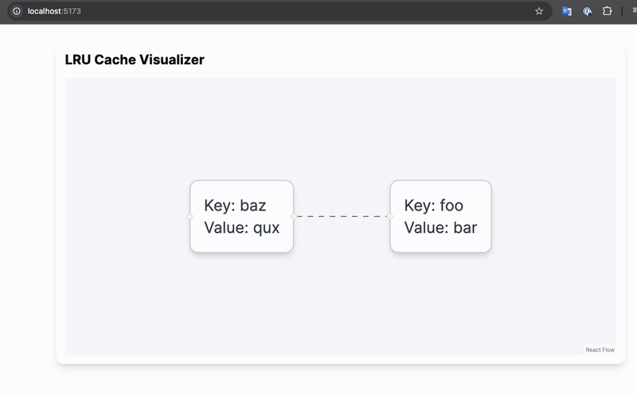

# LRU cache with TTL

This is a simple in-memory [LRU cache](https://en.wikipedia.org/wiki/Cache_replacement_policies#Least_Recently_Used_(LRU)) implemented in GO, complete with TTL expiration, observability and a visual demo.

## Why?

This is a portfolio project. Caching is essential for building web applications that scale, so I set out to implement one type of cache that would be useful in a real-world application. To make it easier to understand and demo, I also built a small visualizer.

### Design Musings

## Mutex

To create a thread safe version of the LRU cache I used `sync.Mutex`, on the surface it would seem like using `sync.RWMutex` but it requires duplicating the LRU code for `SafeLRUCache` AND, since the LRU cache re-orders itself when an item is read, leads to minimal gains.

## Features
- ⚡ Thread-safe Go LRU cache
- ⏱️ Optional TTL support
- 📊 Prometheus metrics endpoint (/metrics)
- 🔍 Live cache state via /cache endpoint
- 🧩 Interactive frontend using React Flow
- 🎨 TailwindCSS + Shadcn styling
- 🔄 Drag-and-drop nodes to visualize recency ordering
- ➕ Add new entries via UI dialog

## How to Run

### Backend

```bash
cd visualizer/backend
go run main.go
```

### Frontend
```bash
cd visualizer/my-cache-ui
npm install
npm run dev
```
Make sure the backend is running at localhost:8080.

## Demo

You can drag nodes around or add new cache items via the visual interface. LRU eviction is reflected live.



## Tech Stack

- Go for backend
- React + Vite for frontend
- React Flow for graphs
- TailwindCSS for styles
- Prometheus for metrics